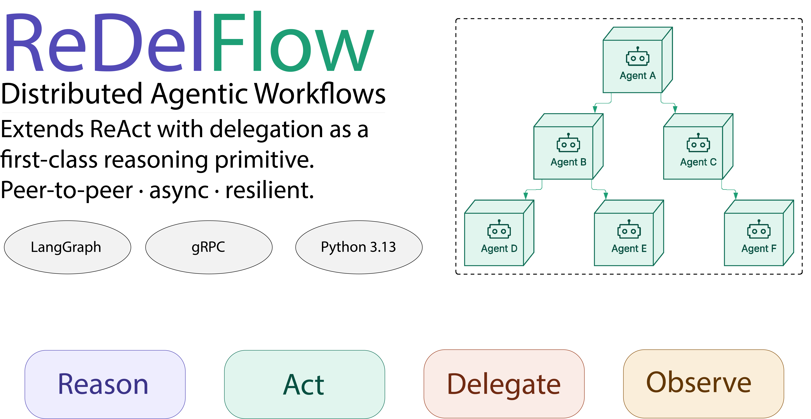

<p align="center">
  
</p>

# ReDelFlow

**ReDelFlow** is a proof-of-concept framework that operationalizes **ReDel** (Reason–Act with Delegation), a distributed extension of the ReAct paradigm in which delegation to other autonomous agents is treated as a first-class reasoning primitive.

> This framework is the implementation described in the paper:
> *"Beyond the Reasoning-and-Acting Paradigm: A Distributed Coordination Framework for Scalable Agentic AI Workflows"*
> — Riccardo Cantini, Francesco Cozza, Domenico Talia — University of Calabria

---

## The ReDel Paradigm

Classical ReAct structures agent behavior as a loop of **Reason → Act → Observe**, where actions are limited to local tool invocations. This model becomes limiting when complex tasks must be distributed across multiple autonomous agents operating on different nodes.

**ReDel** extends ReAct by introducing **Delegate** as an explicit phase of the reasoning loop:

|Phase|Description|
|-|-|
|**Reason**|The agent analyzes the current context and determines the next step|
|**Act**|The agent invokes local tools or external services|
|**Delegate**|When the task exceeds local scope, the agent delegates sub-tasks to neighboring agents|
|**Observe**|The agent incorporates outcomes of tools or delegated computations before the next reasoning step|

Unlike treating delegation as a passive tool call, ReDel models it as the transfer of a sub-task to another **autonomous reasoning entity** — one that maintains its own context, executes its own ReDel cycle, and may further propagate delegation. Global workflow execution emerges from the interaction of multiple local reasoning cycles rather than from a single centralized controller.

---

## Architecture

Each node in a ReDelFlow workflow is an autonomous agent that:

* Receives requests from other agents or from the client via **gRPC**
* Executes a local **ReDel reasoning cycle** implemented as a LangGraph state machine
* Maintains **conversation memory** across interactions
* Invokes **local tools** or **delegates sub-tasks** to neighboring agents
* Returns results asynchronously

Inter-agent communication is fully **peer-to-peer**: there is no central router mediating message delivery. The workflow topology — which agents exist, their roles, and which agents they can delegate to — is defined declaratively in a JSON configuration file.

--- 

## Key Properties

**Parallel delegation** — an agent can delegate sub-tasks to multiple neighbors simultaneously and wait for all responses before continuing its reasoning cycle.

**Adaptive control flow** — execution paths are not predefined. Each agent decides at runtime whether to act locally, delegate, or respond, based on its current context and intermediate results.

**Resilience** — when a neighbor is unreachable or returns an error, agents adapt through retries, fallback delegation, or autonomous task completion using available tools.

**Peer-to-peer communication** — all inter-agent communication is direct. There is no centralized host mediating message delivery, which avoids coordination bottlenecks and improves scalability.

**Conversation memory** — each agent maintains a history of past interactions per conversation, injected as context at every reasoning step to support coherent multi-turn execution.

---

## Project Structure

```
redel-flow/
├── redel_flow/
│   ├── config/
│   │   └── configurations.py        # API keys and retry settings
│   ├── core/
│   │   ├── redel_node.py            # gRPC node: request handling, delegation, memory
│   │   ├── conversation_state.py    # conversation state and history management
│   │   ├── redel_agent.py           # LangGraph reasoning graph (ReDel cycle)
│   │   ├── llm/
│   │   │   ├── prompts.py           # system, context and interaction prompt templates
│   │   │   └── llm_validation.py    # Pydantic models for structured LLM output
│   │   └── proto/                   # gRPC protocol definitions and generated stubs
│   ├── deploy/
│   │   ├── network.py               # host resolution and address utilities
│   │   ├── topology.py              # topology loading and validation
│   │   ├── env_builder.py           # container environment variable builders
│   │   ├── docker_ops.py            # Docker container lifecycle management
│   │   ├── logs.py                  # container log streaming
│   │   └── run_single_agent.py      # container entrypoint (used internally by Docker)
│   └── scripts/
│       ├── run_topology_dev.py      # dev mode: local processes, no Docker
│       ├── run_topology.py          # Docker mode: local or distributed containers
│       └── client.py               # interactive client
└── examples/
    ├── story_writing_team.json       # simple creative writing pipeline
    ├── editorial_team.json           # distributed newsroom
    ├── open_discovery.json           # scientific paper analysis
    └── remote_example.json          # distributed deploy example
```

---

## Requirements

**Always required:**

* Python 3.13
* A Google AI API key (Gemini 2.5 Pro)
* A Tavily API key — optional, only for agents that use the `search` tool

**For Docker modes (local Docker and distributed):**

* Docker Desktop (Windows / macOS) or Docker Engine (Linux)

**For distributed mode only:**

* A public IP address reachable by all machines in the network
* An SSH key for each remote machine
* Docker installed on each remote machine, with the SSH user in the `docker` group

---

## Installation

```bash
git clone https://github.com/CozzaFrancesco/redel-flow.git
cd redel-flow

python -m venv .venv
source .venv/bin/activate        # Windows: .venv\\Scripts\\activate

pip install -r requirements.txt
```

For Docker modes, install the additional deploy dependencies:

```bash
pip install -r requirements-deploy.txt
```

---

## Configuration

Copy the environment template and fill in your API keys:

```bash
cp .env.example .env
```

Edit `.env`:
GOOGLE_API_KEY=your_google_api_key_here
TAVILY_API_KEY=your_tavily_api_key_here

API keys are the only values that belong in `.env`. All network addresses (agents, orchestrator, client) are defined in the topology JSON file.

> **Model:** ReDelFlow currently uses **Gemini 2.5 Pro** as the underlying LLM for all agents. The model is configured in `redel_flow/core/redel_agent.py`.

---

## Defining a Workflow Topology

A topology is a JSON file in the `examples/` folder that declares the full agent network. Every topology must include:

```json
{
  "orchestrator": { "host": "localhost", "port": 6000 },
  "client":       { "host": "localhost", "port": 7000 },
  "entrypoints": ["agentA"],
  "agents": [
    {
      "name": "agentA",
      "role": "Writer",
      "description": "Writes short stories of about 200 words, coordinating with a reviewer.",
      "host": "localhost",
      "port": 50051,
      "neighbors": ["agentB"]
    },
    {
      "name": "agentB",
      "role": "Reviewer",
      "description": "Reviews stories and provides feedback on clarity, structure and coherence.",
      "host": "localhost",
      "port": 50052,
      "neighbors": []
    }
  ]
}
```

|Field|Description|
|-|-|
|`orchestrator`|Host and port where the orchestrator runs. Must be reachable by all agents.|
|`client`|Host and port where the client listens for responses. Must be reachable by all agents.|
|`entrypoints`|Agents that the orchestrator can directly contact.|
|`agents`|The full list of agents in the network.|

**Agent fields:**

|Field|Required|Description|
|-|-|-|
|`name`|✅|Unique agent identifier|
|`role`|✅|Functional role, shown to neighboring agents|
|`description`|✅|What the agent does, shown to neighboring agents|
|`host`|✅|IP address or `localhost` where the agent runs|
|`port`|✅|Port the agent listens on|
|`neighbors`|✅|Agents this agent can delegate to|
|`tools`|❌|Tools available to the agent (see below)|
|`replicas`|❌|Number of identical agent instances to deploy|

> **Note on descriptions:** descriptions are shown to neighboring agents at runtime to help them decide whom to delegate to. Write them in third-person and keep them concise.

---

### Supported Tools

|Key|Tool|Requirement|
|-|-|-|
|`search`|Tavily web search|Tavily API key|
|`arxiv_search`|arXiv paper search|None|
|`python`|Python REPL|None|

```json
"tools": {
  "search": {
    "tip": "Use this tool to search for recent news and information."
  }
}
```

The `tip` field is included in the agent's system prompt to guide when and how to use the tool.

---

### Agent Replicas

Multiple identical instances of the same agent can be deployed:

```json
{
  "name": "Reader",
  "role": "Document Reader",
  "description": "Reads and summarizes scientific papers.",
  "host": "localhost",
  "replicas": 3,
  "ports": [50060, 50061, 50062],
  "neighbors": []
}
```

Replicas are automatically named `ReaderReplica1`, `ReaderReplica2`, `ReaderReplica3`. Any neighbor reference to `Reader` is expanded to all replicas.

---

## Deployment Modes

ReDelFlow supports three deployment modes. The topology JSON is the same across all modes — only the `host` values and the launch command differ.

---

### Mode 1 — Dev (local processes)

Agents run as plain Python processes on the local machine. No Docker required. Ideal for rapid development and debugging.

All `host` values in the topology must be `localhost`.

```bash
python -m redel_flow.scripts.run_topology_dev --topology examples/story_writing_team.json
```

In a separate terminal:

```bash
python -m redel_flow.scripts.client --topology examples/story_writing_team.json
```

---

### Mode 2 — Local Docker

Agents run as Docker containers on the local machine. Useful for testing the containerized deployment before moving to distributed.

All `host` values in the topology must be `localhost`.

```bash
python -m redel_flow.scripts.run_topology --topology examples/story_writing_team.json
```

Add `--rebuild` to force a Docker image rebuild when the framework code changes:

```bash
python -m redel_flow.scripts.run_topology --topology examples/story_writing_team.json --rebuild
```

In a separate terminal:

```bash
python -m redel_flow.scripts.client --topology examples/story_writing_team.json
```

---

### Mode 3 — Distributed

Agents run as Docker containers on different machines. Each machine must have Docker installed and a public IP address reachable by all other machines in the network.

**Prerequisites for each remote machine:**

```bash
# Install Docker (Amazon Linux / RHEL)
sudo dnf install -y docker
sudo systemctl start docker
sudo systemctl enable docker
sudo usermod -aG docker $USER   # then log out and back in
```

**Topology configuration:**

Replace `localhost` with each machine's public IP. Add a `hosts` section with SSH credentials for every **remote** machine:

```json
{
  "orchestrator": { "host": "YOUR_LOCAL_OR_REMOTE_PUBLIC_IP", "port": 6000 },
  "client":       { "host": "YOUR_LOCAL_PUBLIC_IP", "port": 7000 },
  "entrypoints": ["Writer"],
  "hosts": {
    "REMOTE_MACHINE_IP": {
      "ssh_user": "YOUR_SSH_USER",
      "ssh_key": "PATH/TO/YOUR/KEY.pem"
    }
  },
  "agents": [
    {
      "name": "Writer",
      "role": "Story Writer",
      "description": "Writes short stories of about 200 words, then asks the Reviewer for feedback.",
      "host": "REMOTE_MACHINE_IP",
      "port": 50051,
      "neighbors": ["Reviewer"]
    },
    {
      "name": "Reviewer",
      "role": "Story Reviewer",
      "description": "Reviews stories and provides structured feedback on clarity, narrative flow and coherence.",
      "host": "REMOTE_MACHINE_IP",
      "port": 50052,
      "neighbors": []
    }
  ]
}
```

> **Important:** `client` always run on the machine that launches `run_topology.py`. His `host` must be a public IP reachable by all agents — including those on remote machines.

**Launch:**

```bash
python -m redel_flow.scripts.run_topology --topology examples/remote_example.json
```

The script automatically:

1. Builds the Docker image locally
2. Transfers it to each remote machine via SSH
3. Starts containers on each machine with the correct configuration
4. Streams logs from all containers to the local terminal

In a separate terminal:

```bash
python -m redel_flow.scripts.client --topology examples/remote_example.json
```

To stop all containers, press `Ctrl+C` in the `run_topology` terminal and wait for them to stop.

---

## Contributing

ReDelFlow is a proof-of-concept framework developed for research purposes, and contributions are welcome. If you have ideas, bug reports, or want to extend the framework, feel free to open an issue or a pull request.

For academic inquiries or collaboration, you can reach the authors at:

- Riccardo Cantini — [riccardo.cantini@unical.it](mailto:riccardo.cantini@unical.it)
- Francesco Cozza — [francescocozza@unical.it](mailto:francescocozza@unical.it)
- Domenico Talia — [d.talia@dimes.unical.it](mailto:d.talia@dimes.unical.it)
